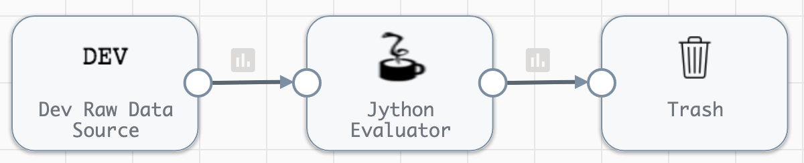
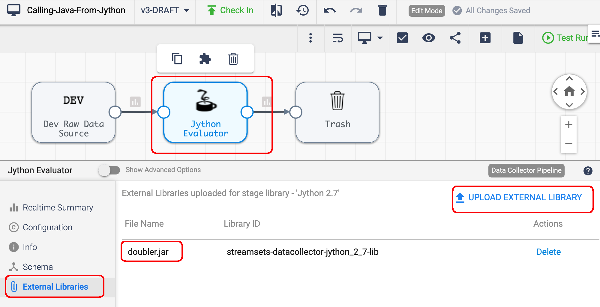

## sdc-calling-custom-java-from-jython

### Overview

This project provides an example of creating and packaging a custom Java class within a jar file, loading the jar file into an [SDC](https://streamsets.com/products/dataops-platform/data-collector/) [Jython Evaluator](https://streamsets.com/documentation/datacollector/latest/help/datacollector/UserGuide/Processors/Jython.html#concept_a1h_lkf_lr), and calling both static and instance methods on the class from the Jython script.


### Requirements
- [Maven](https://maven.apache.org/) is needed to compile the Java class and to package it in a Jar file

- SDC with the Jython stage library 

### Inspect the Java source file

The Java source file is a trivial class with one instance method and one static method:

````
package com.onefoursix;

public class Doubler {

  public long double_it_instance_method(int x){
   return 2 * x;
  }
  
  public static long double_it_static_method(int x){
    return 2 * x;
  }
}
````

### Build the Java project

- Clone this project to your local machine.

- Switch to the ````java```` directory and execute the command

        $ ./build.sh
        
  That will generate the file ````doubler.jar````
  
  
### Import the example pipeline

Import the project's pipeline ````CallingJavaFromJython.json```` into SDC.  The pipeline looks like this:



The Dev Raw Data Source generates a single record with the field ````x```` with a value of ````7````

### Import the jar file into the Jython stage

Import the ````doubler.jar```` file into the Jython stage:



### Inspect the Jython script

The Jython script has this Jython code that imports the ````com.onefoursix.Doubler```` class from the jar,  calls a static method on the class, then creates an instance of the class and calls a method on the instance.

Here is the Jython code:

````
from com.onefoursix import Doubler
for record in sdc.records:
  try:
    
    # Read an int field from a record
    x = record.value['x']
    
    # Call a static method on the Java class to double the record field value
    record.value['doubled_by_static_method'] = Doubler.double_it_static_method(x)
    
    # Create an instance of the Doubler class
    d = Doubler()
    
    # Call a method on the instance to double the record field value
    record.value['doubled_by_instance_method'] = d.double_it_instance_method(x)
    
    sdc.output.write(record)
  except Exception as e:
    sdc.error.write(record, str(e))
````

